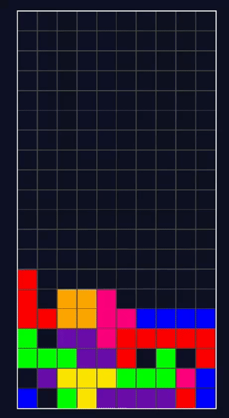

# Genetic Tetris Algorithm


[](https://matissecallewaert.github.io/ai-tetris/)

## Description

Welcome to the Tetris AI project! This project allows users to either play Tetris themselves or let an AI play and improve its strategy over time using a genetic algorithm.

The AI learns to play better by evolving its strategy based on the outcomes of previous games. More information about genetic algorithms can be found on [Wikipedia](https://en.wikipedia.org/wiki/Genetic_algorithm) or [GeeksforGeeks](https://www.geeksforgeeks.org/genetic-algorithms/).

Check out the live demo [here](https://matissecallewaert.github.io/ai-tetris/).

## Demo



Experience the Tetris AI in action on our [website](https://matissecallewaert.github.io/ai-tetris/).

## Features

- **Play Tetris**: Enjoy the classic game.
- **AI Gameplay**: Watch an AI learn and improve its Tetris gameplay using a genetic algorithm.
- **Real-time Learning**: Observe the AI's progress and performance over multiple generations.

## Installation

To run this project locally, follow these steps:

1. Clone the repository:

    ```sh
    git clone https://github.com/matissecallewaert/ai-tetris.git
    ```

2. Navigate to the project directory:

    ```sh
    cd ai-tetris
    ```

3. Open `index.html` in your preferred web browser.
