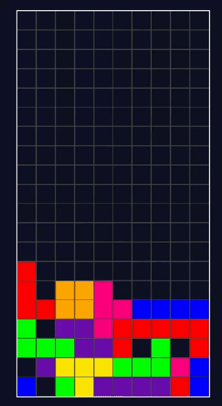

# AI Tetris

This is the source code of a website that lets you play tetris, or train an AI to play it for
you — and watch four different learning algorithms work the game out from scratch.

 [](https://matissecallewaert.github.io/ai-tetris/)



## What you can do

- **Play it yourself** — the original game, keyboard controls, hold and next-piece previews.
- **Train an AI** on the dashboard: pick an algorithm, set the population size and worker
  count, and watch best/average score and survival length climb generation by generation.
- **Compare algorithms side by side** by selecting more than one — they train concurrently
  and are plotted on the same charts.
- **Name and save** the best agent a run produced, building up a roster of your own AIs.
- **Run a contest** between saved AIs over identical seeded piece sequences, so nobody wins
  on luckier pieces.
- **Read how each algorithm works** on its own illustrated page, using this same game as the
  worked example.

## The algorithms

| Algorithm | What a candidate *is* | How it improves |
| --- | --- | --- |
| Genetic Algorithm | 11 feature weights | Breeds the fittest of a population: elitism, tournament selection, crossover, mutation |
| CMA-ES | 11 feature weights | Moves and reshapes a sampling distribution toward whatever scored best |
| NEAT | A neural network that grows | Evolves the network's *structure*, with speciation protecting new shapes |
| Reinforcement Learning | 11 feature weights | Adjusts after every single move, from the reward it just received |

All four score a board the same way — 11 features (holes, aggregate height, bumpiness, row
and column transitions, landing height, eroded cells, …) — so their results are directly
comparable. What differs is entirely how the next candidate gets produced.

The evolutionary three reach many thousands of moves per game. Reinforcement learning
visibly learns but plateaus far below them, which is a real and well-known property of
one-step TD on this problem rather than a bug — its explainer page says so plainly.

## Running it locally

There is no build step; it's plain ES modules. Any static file server works:

```bash
python3 -m http.server 8000
```

Then open <http://localhost:8000>.

Opening `index.html` straight from the filesystem will *not* work — ES modules and web
workers both require a real origin.

## Tests and linting

```bash
npm test      # unit tests via node:test, no test framework needed
npm run lint  # eslint
```

## How it's put together

```
scripts/
  main.js              game entry point
  dashboard.js         training dashboard controller
  contest.js           roster + contest controller
  modules/
    tetris.js          game engine (pure, no DOM)
    renderer.js        canvas drawing
    input.js           keyboard handling
    ai/
      board-evaluator.js   the 11 board features
      move-search.js       enumerate placements, pick the best (optional 1-piece lookahead)
      play-episode.js      play one full game with a given agent
      training-manager.js  worker pool, generations, algorithm-agnostic
      genetic-algorithm.js / cma-es.js / neat/ / rl/
      roster.js            named, saved agents
      contest-runner.js    fair head-to-head matches
```

Training is parallelised across web workers so the UI stays responsive.

### Adding another algorithm

Every algorithm is just an object with two methods:

```js
{
  createPopulation(size, rng),        // -> array of candidates
  nextGeneration(evaluated, rng)      // -> array of candidates
}
```

`training-manager.js`, the worker pool, persistence and the charts are all written against
that interface and don't know which algorithm they're running. Adding a fifth means writing
that object, adding one entry to `ALGORITHM_META` in `scripts/dashboard.js`, and adding a
chip plus an `<option>` in `dashboard.html`.

If the new algorithm needs a different candidate shape than a flat weight vector (the way
NEAT does), teach `genome-shape.js` to recognise it and `genome-scoring.js` to score it —
everything downstream then works unchanged.
